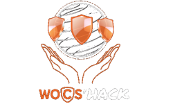
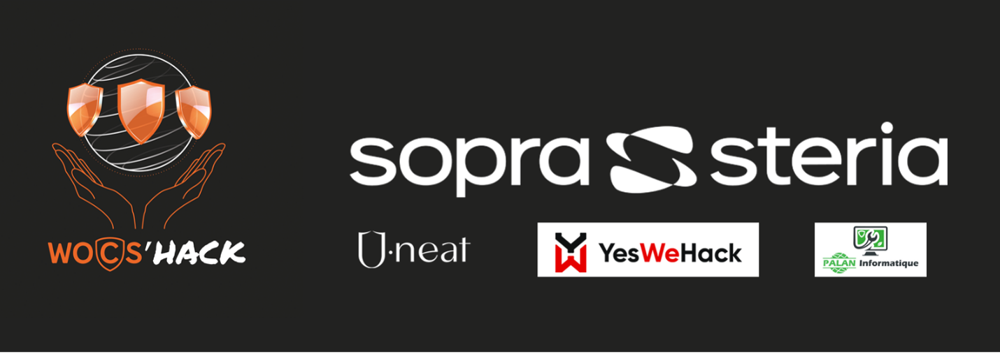

# WOCS'hAck

 
WOCS'hAck is an annual online bug bounty challenge organized by the Worldwide Open Cyber Security Association (WOCSA). The event aims to improve cybersecurity by providing students with a realistic scenario to identify and report vulnerabilities on a designated website. Participants are required to submit detailed reports that include their analysis, assessment, and remediation proposals. These reports are evaluated by experts based on their accuracy, detail, and quality.

## Objectives
- Educational Purpose: Provide students with hands-on experience in identifying and reporting cybersecurity vulnerabilities.
- Enhancing Cybersecurity: Improve overall cybersecurity by uncovering and addressing website vulnerabilities.
- Promoting Cybersecurity Awareness: Raise awareness about the importance of cybersecurity in the digital age.

## Event Structure
- Duration: The challenge runs continuously from morning to evening.
- Activities: Teams work on identifying and reporting a variety of vulnerabilities through the YesWeHack platform.
- Evaluation: Reports are scored based on accuracy, detail, and quality by a panel of cybersecurity experts.
- Prizes: Exciting prizes are awarded to the best-performing teams.

## Benefits of Participation
- Skill Development: Enhance practical cybersecurity skills in a realistic, time-bound environment.
- Team Promotion: Showcase the team's and school's cybersecurity capabilities.
- Networking: Engage with peers and experts in the cybersecurity field.
- Enjoyment: Participate in a fun and competitive learning experience.

## Contact Information
- WOCS'hAck Email: wocshack@wocsa.org

# Test the older WOCS'hAck websites
## Install Docker
You will find all the information to install Docker here: https://docs.docker.com/engine/install/

## Build the project
To build the project, go to the folder with the docker-compose.yml file and run: 
`docker compose build`

## Run the project
To run the project, go to the folder with the docker-compose.yml file and run: 
`docker compose up -d`

The option -d stand for detach. If you want to have all the logs, remove this option.

## Stop the project
To run the project, go to the folder with the docker-compose.yml file and run: 
`docker compose down`

# WOCS'hAck#3
