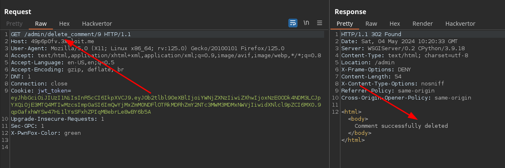

## 📜 Description

Le Cross-site Request Forgery (également connu sous le nom de CSRF) est une vulnérabilité de sécurité web qui permet à un attaquant d'induire les utilisateurs à effectuer des actions qu'ils n'ont pas l'intention d'effectuer (en utilisant des soumissions de formulaire ou des requêtes GET).

## Exploitation

Un attaquant peut exploiter cette vulnérabilité en envoyant un lien malveillant à un administrateur. Si l'administrateur clique sur le lien, le commentaire correspondant à l'ID spécifié dans le lien sera supprimé. Voici un exemple de lien malveillant pour supprimer le commentaire n°9 :

- `http://49p6p0fv.3xploit.me/admin/delete_comment/9`

## 🕵️ PoC

Comme la méthode HTTP utilisée est GET, le CSRF token n'est pas vérifié. Par conséquent, il suffit que l'administrateur clique sur le lien malveillant pour supprimer n'importe quel commentaire.

Nous pouvons constater que l'action a bien été effectuée avec succès :



## 🚧 Conséquences

Lors d'une attaque CSRF réussie, l'attaquant amène l'utilisateur victime à effectuer une action involontairement. Dans notre cas, il est possible de supprimer n'importe quel commentaire du site.

## 🔐 Remediation

1. **Utiliser des méthodes HTTP appropriées**: Les requêtes GET ne doivent pas permettre d'effectuer des actions destructives. Il faut restreindre ces actions aux méthodes HTTP POST, DELETE ou PUT.

2. **Implémenter des jetons CSRF**: La méthode la plus robuste pour se défendre contre les attaques CSRF est d'inclure un jeton CSRF dans les demandes pertinentes. Le jeton doit être :
   - Imprévisible avec une grande entropie, comme pour les jetons de session en général.
   - Lié à la session de l'utilisateur.
   - Strictement validé dans chaque cas avant que l'action pertinente ne soit exécutée.

Exemple d'un formulaire HTML qui utilise un jeton CSRF :

```html
<form action="/profile" method="POST">
    <input type="text" name="name" value="">
    <input type="email" name="email" value="">
    <input type="hidden" name="csrf" value="d192140e2f1db42d60e508731b4095c08447c985c34a3b7a580e88e5c8b1d9a5">
</form>
```

3. **Valider les origines des requêtes**: Utiliser les en-têtes de contrôle d'origine (Origin et Referer) pour s'assurer que les requêtes proviennent de sources fiables.

4. **Mettre en œuvre la vérification de session**: S'assurer que les actions critiques ne peuvent être effectuées que par des utilisateurs authentifiés et valider leur session active.

## 📚 Références
 
- [PortSwigger - Cross-site request forgery (CSRF)](https://portswigger.net/web-security/csrf)
- [PortSwigger - CSRF Tokens](https://portswigger.net/web-security/csrf/tokens)

# Author
ENSIBS-GCC_Chasseur_de_bogue