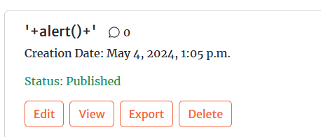
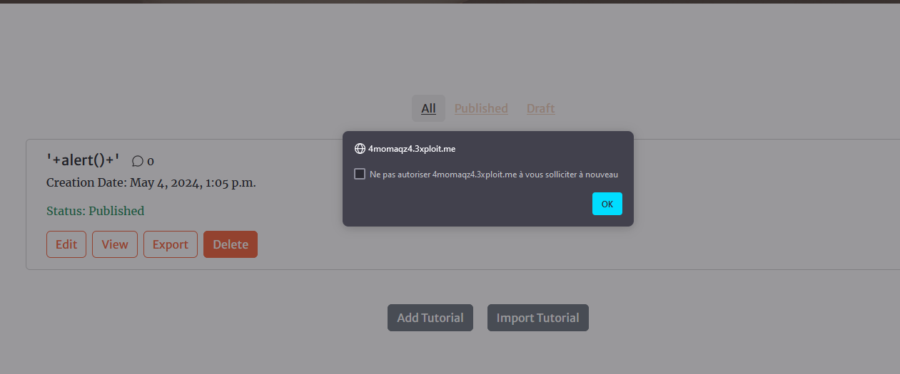
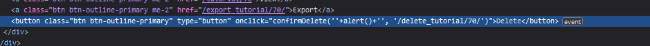

## Description

Lors d'une évaluation de sécurité sur votre plateforme, j'ai identifié une vulnérabilité XSS (Cross-Site Scripting) DOM-based permettant d'exécuter du JavaScript lors de la suppression d'un tutoriel.

## Exploitation

Le contenu du paramètre `title` est inséré dans un attribut `onclick` JavaScript du DOM sans être correctement échappé. Cela permet d'injecter une charge utile JavaScript malveillante.

## Étapes pour reproduire

1. Ajouter un article avec le titre suivant :

```html
'+alert()+'
```

2. Cliquer sur le bouton "Supprimer".



3. Une popup s'affiche en résultat.



Nous pouvons constater que le contenu du paramètre est reflété dans du JavaScript DOM-based inline sans filtrage :



## Risque

Les conséquences d'une vulnérabilité XSS DOM-based peuvent être graves :

- **Divulgation du cookie de session** : Permettre à un attaquant de détourner la session de l'utilisateur et de prendre le contrôle du compte (uniquement si le drapeau HttpOnly du cookie est défini sur false).
- **Redirection de l'utilisateur** : Vers une autre page ou site (comme des sites de phishing).
- **Modification du contenu de la page actuelle** : Ajout d'une fausse page de connexion qui envoie des informations d'identification à l'attaquant.
- **Téléchargement automatique de fichiers malveillants**.
- **Demande d'accès à la géolocalisation / caméra de la victime**, etc.

## Correction

Pour éviter les attaques XSS, il est crucial de s'assurer que toutes les variables passent par une validation stricte et sont ensuite échappées ou désinfectées. Voici quelques mesures à prendre :

1. **Échapper les caractères spéciaux** : Utiliser des fonctions comme `htmlspecialchars` en PHP pour échapper les caractères spéciaux dans le contenu généré dynamiquement.

   ```php
   $safe_title = htmlspecialchars($title, ENT_QUOTES, 'UTF-8');
   ```

2. **Utiliser des attributs de sécurité** : Assurer que les cookies de session ont le drapeau `HttpOnly` défini sur true pour empêcher l'accès via JavaScript.

   ```php
   setcookie('session', $value, ['httponly' => true]);
   ```

3. **Valider les entrées utilisateur** : Implémenter une validation stricte sur toutes les entrées utilisateur pour s'assurer qu'elles ne contiennent pas de code malveillant.

4. **Sanitizer les données** : Utiliser des bibliothèques ou des frameworks qui offrent des mécanismes de désinfection des données.

5. **Éviter l'injection dans les attributs JavaScript** : Si possible, éviter d'injecter directement des données utilisateur dans les attributs JavaScript.

En appliquant ces mesures, vous pouvez grandement réduire le risque d'attaques XSS et protéger votre application et vos utilisateurs.

# Author
ESNA-ESNArcotrafiquants