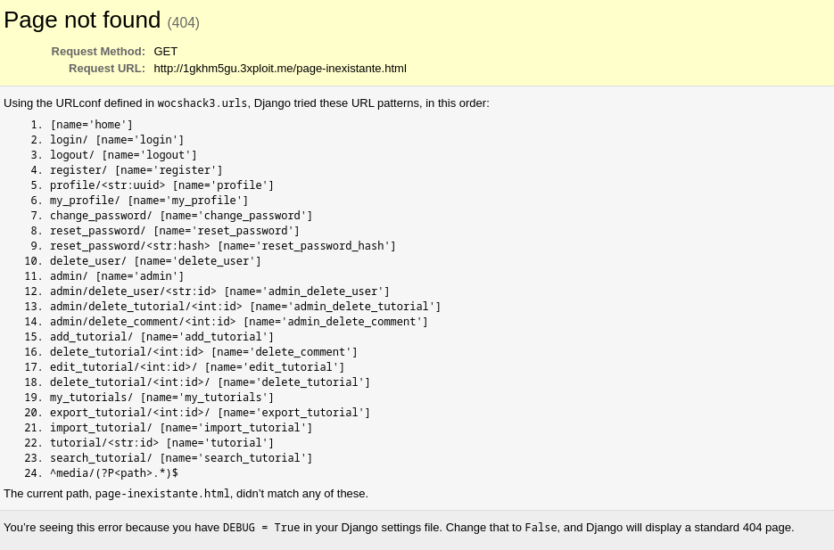

# Description
This vulnerability occurs in web applications when the error message displayed for a page not found (404 error) inadvertently reveals sensitive information about the application's structure, including the appearance of all possible endpoints. These details can be exploited by attackers to gain insights into the application's functionalities and identify potential weak points. This attack is possible because DEBUG mode is enabled.

# Exploitation
An attacker can exploit this vulnerability by following these steps:

### 1 - Creating Malicious Requests
The attacker starts by creating URLs that point to non-existent resources within the application. This might involve manipulating existing URLs, adding random parameters, or exploiting known directory traversal techniques.

### 2 - Analyzing Error Messages
The attacker then analyzes the error messages returned by the application for any disclosure of sensitive information. They look for specific keywords or patterns that might reveal internal details about the application, such as an administrator page.

### 3 - Exploiting Obtained Information
Based on the information gathered from the error messages, the attacker may attempt more advanced exploitation strategies. This can include identifying exploitable files or scripts.

# Proof of Concept (PoC)
We performed this attack by modifying the URL in the browser. The URL used was `http://1gkhm5gu.3xploit.me/page-inexistante.html`.



An attacker could also use the `curl` command as follows:
```bash
curl http://1gkhm5gu.3xploit.me/page-inexistante.html
```

# Risk
This vulnerability can pose a significant risk to the application, its users, and the business. Here is a risk analysis:

### 1 - Increased Attack Surface
The disclosed information can expand the attack surface of the application by providing attackers with additional targets, potentially leading to more sophisticated attacks.

### 2 - Data Leaks
In rare cases, the error message might reveal sensitive data, such as database connection details. Attackers could exploit this to gain unauthorized access to confidential information.

### 3 - Loss of Trust
If a vulnerability is exploited and user data is compromised, it can lead to a loss of trust in the company and its application.

# Remediation
We recommend implementing custom error pages to prevent such enumeration. Instead of relying on default error messages, develop custom error pages that provide minimal information and a user-friendly message indicating the requested resource is not found.

Another possible remediation is simply disabling DEBUG mode to display Django's standard error page.

# Author
Cy-TechPau_PaukyBlinders