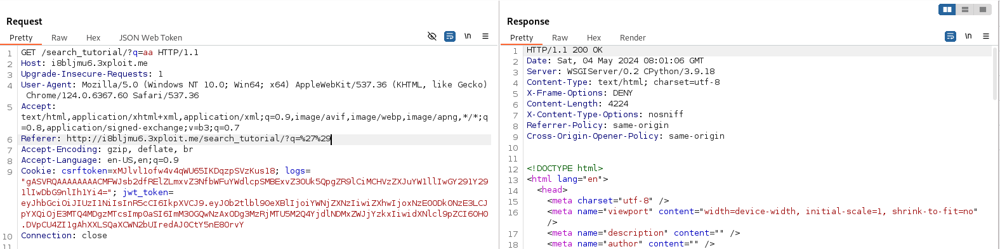

# Description
The `Server` header reveals the services used and their versions:
- WSGI Server/0.2
- CPython/3.9.18

# PoC & Exploitation
Simply navigating the web application using a proxy like Burp allows retrieving information from the headers returned by the server. The `Server` header reveals these details.

# Risk
An attacker obtaining this information can tailor their future attacks by considering the version of CPython and WSGI Server in use.

# Remediation
Update the CPython and WSGI Server services and configure the server to not display the services and their versions in the `Server` header.

# Author
ESGITOULOUSE-SMTPIED