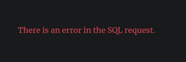
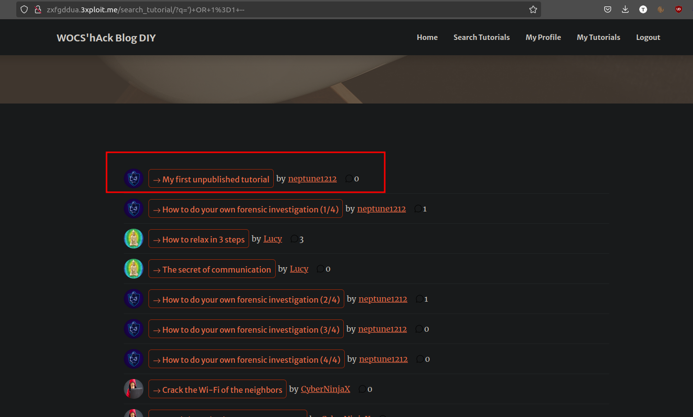

# Description

An SQL injection is possible via the tutorial search functionality.

# Exploitation

On the search page <http://zxfgddua.3xploit.me/search_tutorial>, it is possible to execute an SQL injection.

Using the payload `'--` results in an error being displayed.

# PoC

Using the payload `') OR 1=1 --` allows leaking all tutorials (including unpublished ones).

# Risk

Through this SQL injection, it is possible to retrieve and modify all the data in the database. The integrity, confidentiality, and availability of the data for users and the business are compromised.

# Remediation

To prevent SQL injections, user inputs must be sanitized and special characters escaped before processing data. Using an ORM (Object-Relational Mapping) framework is very common today and helps to avoid SQL injections.

OWASP Recommendations: [SQL Injection Prevention Cheat Sheet](https://cheatsheetseries.owasp.org/cheatsheets/SQL_Injection_Prevention_Cheat_Sheet.html)

# Author
EpitechToulouse-Chocolackteam