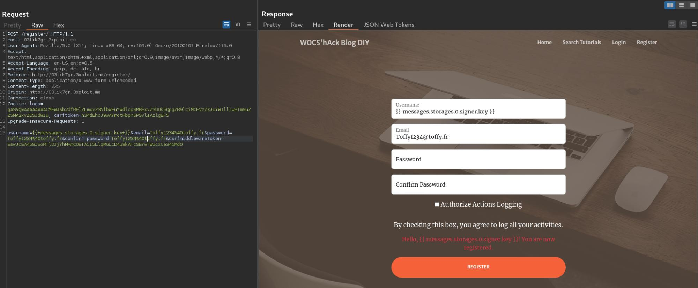
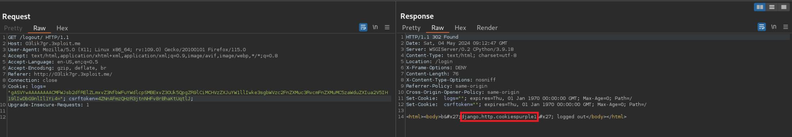

## Description

Server-Side Template Injection (SSTI) is a vulnerability that occurs when an attacker can inject and execute arbitrary code in the server-side templates of a web application. In the context of Django (Python), SSTI can happen when using its template engine improperly.

## Exploitation

The application is vulnerable to SSTI in requests to the “/logout” endpoint. During the logout process, the `username` attribute of the serialized cookie 'log' is used to display the message “[username] logged out”. This input is not validated by the server, allowing for template injection in the `username` parameter.

## PoC

Creating a user with a username that includes a payload to display the `SECRET_KEY` variable:

Displaying the `SECRET_KEY` variable during logout:

## Risk

SSTI in Django exposes your application to the execution of arbitrary code on the server via the injection of malicious code into the templates. This can lead to data compromise and server takeover.

## Remediation

- Validate user inputs before using them in templates.
- Avoid using untrusted data directly in templates.
- Use filters in Django templates to ensure that user data is properly escaped before being displayed.

## References

- [Django Template Engine](https://docs.djangoproject.com/en/stable/ref/templates/language/)
- [OWASP Template Injection](https://owasp.org/www-community/attacks/Template_Injection)

# Author
ESILV_Masofgon_DaVinciCode