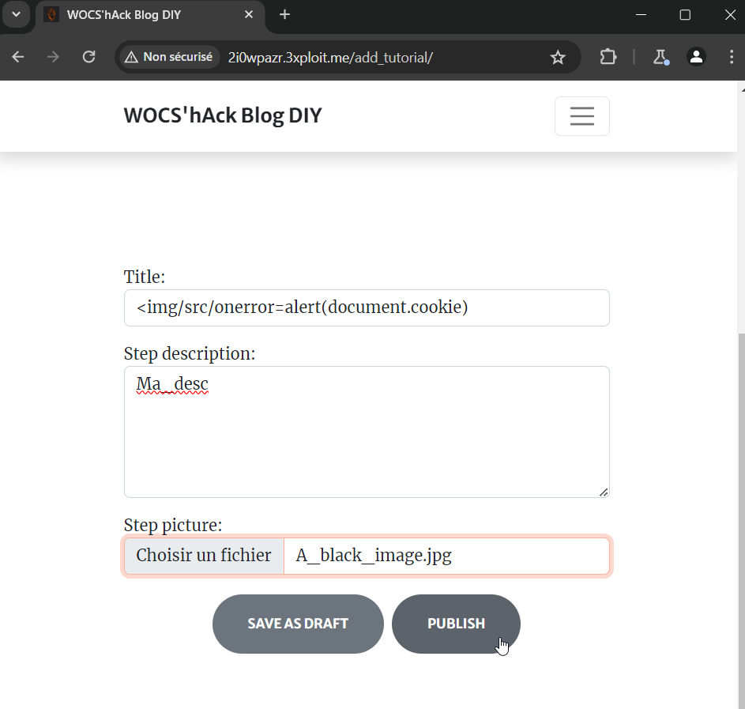
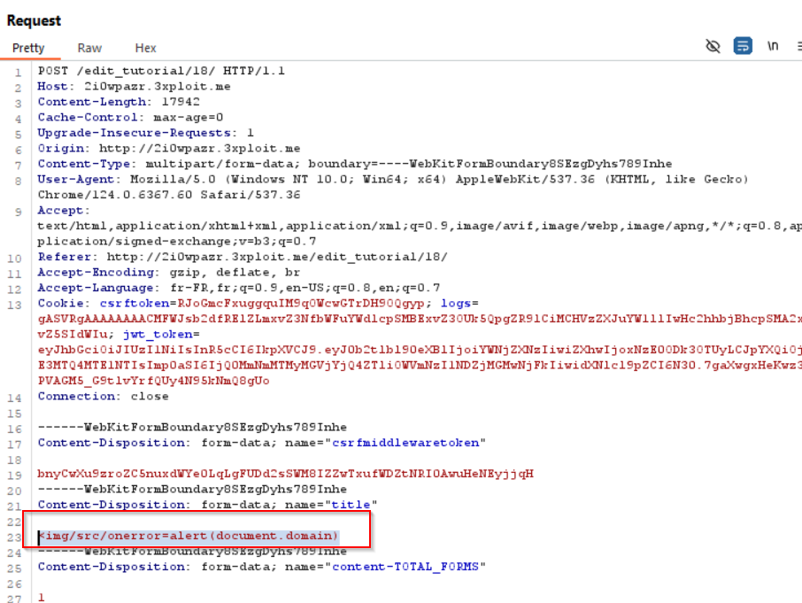
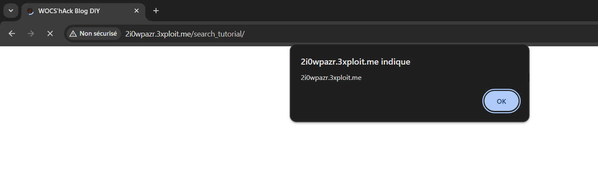
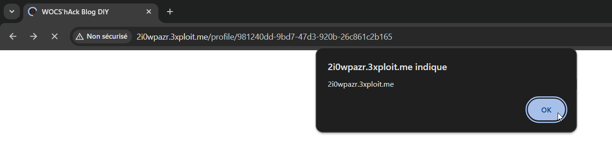

# Description
A Cross-Site Scripting (XSS) vulnerability allows an attacker to inject malicious HTML and/or JavaScript code into web pages viewed by users. 

Stored XSS occurs when an attacker injects malicious code into a web page, and this code is stored on the server. The malicious code is executed every time someone accesses the web page, including users who did not provide data to the attacker.

# Exploitation
The "title" parameter is vulnerable to XSS injection. If `` is injected into the tutorial title, the code will be executed on the following endpoints:
- `http://2i0wpazr.3xploit.me/search_tutorial/`
- `http://2i0wpazr.3xploit.me/profile/981240dd-9bd7-47d3-920b-26c861c2b165`

# PoC
Injection in the title:

Here is what it looks like in the HTTP request:

Executed code:

# Risk
The main risk lies in session cookie theft and the injection of JavaScript code that prompts the user to enter their password in a malicious form.

# Remediation
There are libraries available that effectively filter user-supplied content (content management systems).
- Always sanitize the HTML code generated by the application before sending it to the browser.
- Filter displayed or saved variables containing '<' and '>' characters (in CGI or PHP). More generally, prefix variables containing strings from external sources (e.g., using the prefix "us" for user strings) to distinguish them from others, and never use any of these values in an executable string (especially an SQL string, which can also be targeted by SQL injection) without prior filtering.
- In PHP:
  - Use the `htmlspecialchars()` function, which filters '<' and '>' (as mentioned above).
  - Use the `htmlentities()` function, which is similar to `htmlspecialchars()` but filters all characters equivalent to HTML or JavaScript encoding.

# Author
supdevinci-HexPl0it